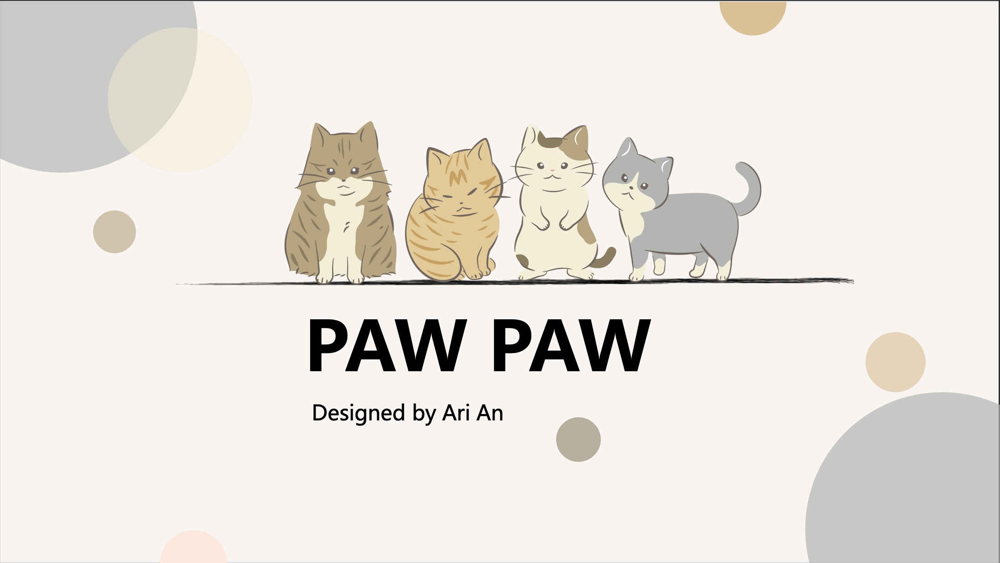
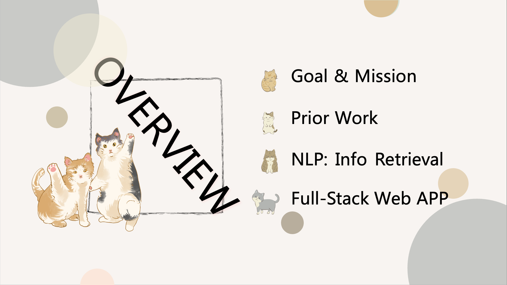
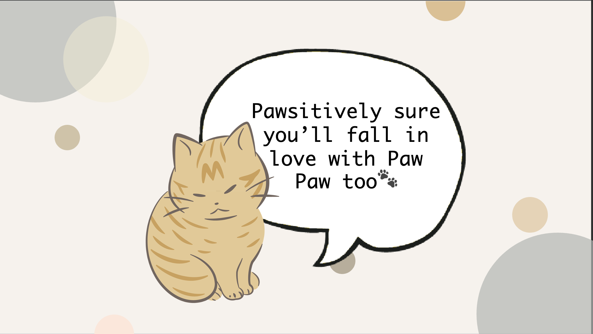

# Paw Paw🐾
PawPaw is dedicated to connecting college students with therapy cats, whether they need a furry companion for a short-term therapy session or are looking to adopt a long-term therapy cat. Our mission is to promote mental health and happiness by providing students with the opportunity to request or adopt a loving feline friend.

# Flow🐾

